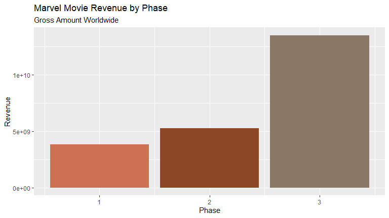
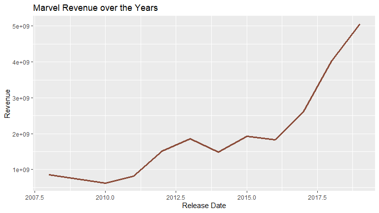

Marvel Over Time
================
Lala Rukh

``` r
#load all packages 
library(dplyr)
library(ggplot2)
library(tidyverse)
library(RColorBrewer)
```


``` r
marvel_grossing <- "Marvel.csv" %>% 
  read_csv() 

marvel_phases <- marvel_grossing %>% 
  group_by(Phase) %>% 
  summarise(total_gross = sum(`Grosses(in Dollars)`)) %>% 
  select(Phase, total_gross)
```

``` r
ggplot(data = marvel_phases, mapping = aes( x = Phase, y = total_gross, fill = Phase))+
  geom_col(fill = c("salmon3", "sienna4", "peachpuff4"))+
  labs(title = "Marvel Movie Revenue by Phase", subtitle =  "Gross Amount Worldwide", y = "Revenue")
```

<!-- -->

For clarity, only worldwide figures were used, not domestic or
international. Phase 3 made the most money by a huge margin due to a
multitude of factors. The actors’ individual plots were more developed
by that stage which had the audience more invested in the fandom hence
them being more dedicated to going to watch these films in the theatres.
Phase 3 films also had higher production values due to which the
cinematography, direction and editing were more appreciable as well.

``` r
marvel_year <- marvel_grossing %>% 
  group_by(`Release Date`) %>% 
  summarize(total_gross = sum(`Grosses(in Dollars)`) )
```

``` r
ggplot(data = marvel_year, mapping = aes(x = `Release Date`, y = total_gross))+
  geom_line(color = "salmon4", size = 1.2)+
  labs(title= "Marvel Revenue over the Years", y = "Revenue")
```

<!-- -->

Marvel films did better over time due to growing popularity of the
fandom. As more people talked about it, more people went to see these in
the theatres. The general trend also changed as people generally go to
the theatres more frequently now than they did in the earlier years.

### Sources

[Worldwide Grossing Data](https://www.boxofficemojo.com/)

[Image](https://fifthsun.com/collections/marvel-clothing)
